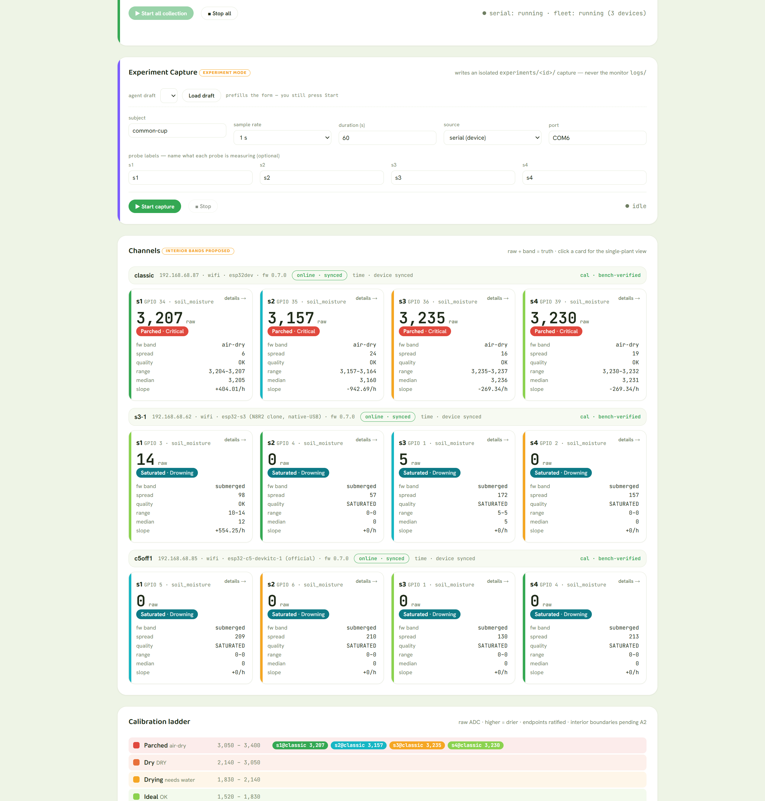
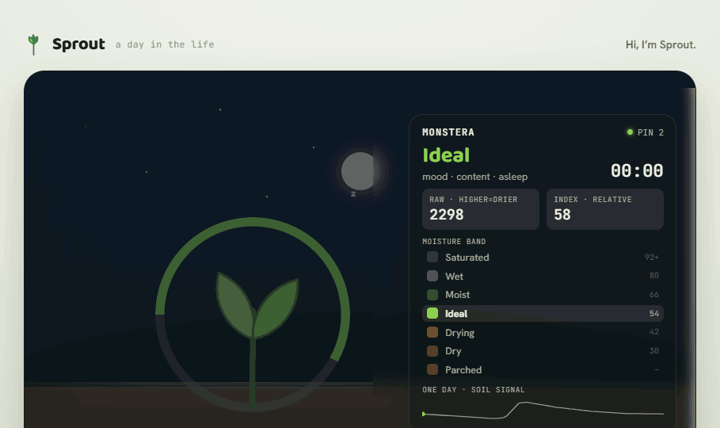

<p align="center">
  <picture>
    <source media="(prefers-color-scheme: dark)" srcset="docs/design/brand/readme-hero.png">
    <source media="(prefers-color-scheme: light)" srcset="docs/design/brand/readme-hero-light.png">
    
  </picture>
</p>

<p align="center">
  
  
  
  <a href="https://github.com/OrangePeachPink/plants/actions/workflows/ci.yml"></a>
</p>

> **Hi, I'm Sprout.** I keep a windowsill of plants properly watered — and I tell you, in plain words, how
> each one is doing. No guesswork, no fake percentages: I read the soil honestly and speak for the plant.

---

## What Sprout is

Sprout is a small, honest, **automatic plant-care system** for a windowsill: capacitive soil-moisture probes
on one or more **ESP32-class boards** — each reporting **over Wi-Fi (untethered)** or a USB-serial cable —
with a **Python** logger and analytics behind them and a served **dashboard** out front. It watches the soil,
classifies it into seven calibrated moisture bands, and (once calibration is in) waters before a plant is
ever in trouble.

The minimum Sprout is deliberately small: **a microcontroller and one soil sensor is already a complete
Sprout** ([ADR-0028](docs/adr/0028-optional-peripherals-doctrine.md)) — a pump, an OLED, and extra probes are
optional enhancements, never an entry bar. And it's past the bench: as of the **v0.7.0 go-live, eight plants
run live in soil**, reporting over Wi-Fi or serial with each session saved to the catalog.

It's a learning-and-portfolio build, made to be **enjoyable to run and trustworthy to read** — process and
tooling sized to match, not over-engineered.

## Quick start

```text
git clone https://github.com/OrangePeachPink/plants && cd plants
uv sync                     # reproduce the exact, locked dev environment
uv run pre-commit install   # the conventions auto-apply on every commit
just start                  # run Sprout — opens the dashboard in your browser
```

New here? You need only two tools — **[uv](https://docs.astral.sh/uv/)** (env + runner) and
**[just](https://github.com/casey/just)** (the command menu) — or click **Open in Codespaces** for a
ready-made env in the browser. Then `just` lists every command, and `just check` runs the same lint + format +
tests that CI does.

Once the dashboard is up, click **▶ Start all collection** — that single action begins polling every
collection path at once (the serial monitor *and* the Wi-Fi fleet). On a brand-new install with no data yet,
the honest empty-state hands you the same Start button, so day one is never a dead-end.

## How it works

```text
   probe          ESP32             classifier            Sprout
   ─────          ─────             ──────────            ──────
   capacitive  →  raw ADC count  →  seven moisture   →   a mood, a first-person line,
   soil read      (higher = drier)  bands (calibrated)   and — when ready — a pump
```

The chain is deliberately honest: **raw counts and the calibrated band are the truth.** Any 0–100 figure is a
clearly-labelled *relative* index between the wet/dry anchors — never presented as real volumetric water
content. A plant's mood, its status color, and any watering all derive from the **band**, never from that
index.

## A look

**Today — the live dashboard.** One command (`just start`) serves this: a functional **Monitor · Capture ·
Lab** view — raw ADC and the calibrated band for every probe, plus the calibration ladder. Plain and
unpolished on purpose, and honest about what it reads: probes in dry air show **Parched**, probes sitting
in water show **Drowning**, because the dashboard shows what the capture actually contains.

<p align="center">
  
</p>

**Where we're headed.** This is the design *direction* — Sprout as a calm, first-person character, the
mood system in motion across a day. It's a concept, not a screenshot, and not built yet — a great place for
a UI/UX contributor to jump in ([#867](https://github.com/OrangePeachPink/sprout/issues/867)).

<p align="center">
  <a href="docs/design/motion/Sprout%20Welcome.dc.html">
    
  </a>
</p>

<p align="center"><sub>Concept, not the app. The design system &amp; mood system live in
<a href="docs/design/">docs/design/</a>.</sub></p>

## The brand

Sprout isn't a readout — it's a **character**. The plant speaks for itself, in the first person, calm and
honest. The full identity, voice rules, the living mark, and the seven-band mood system are in the brand
guide:

- **[Brand guide](docs/design/brand/BRAND.md)** — voice, the living mark + motion, the mood↔band system, the
  character↔instrument boundary.
- **[Design system](docs/design/)** — tokens (`sprout-tokens.css`), instrument components, and the
  [v3 personality layer](docs/design/voice/Sprout%20v3%20Personality%20Layer.dc.html).
- Decisions of record: **[ADR-0007 (brand &amp; voice)](docs/adr/0007-brand-guidelines.md)** ·
  **[ADR-0008 (personality layer)](docs/adr/0008-design-system-v3-personality-layer.md)**.

## Honest by default

A few principles the whole system is built to, so the data can always be trusted:

- **Raw + band = truth;** a percentage is a labelled relative index, never VWC.
- **Mood &amp; automation follow the calibrated band,** never the index.
- **Every number is mono, right-aligned, tabular** — data looks like data.
- **Gaps are surfaced, not smoothed** — the dashboard shows what the capture actually contains.

## Hardware

| Part | Qty | Notes |
| --- | --- | --- |
| Capacitive soil moisture sensor | 4 | Board `HW-390`, silk "Capacitive Soil Moisture Sensor V2.0.0". 3.3-5.5 V in, **0-3.0 V analog out**, 3-pin PH2.0. QA passed - see [`SENSOR_QA.md`](SENSOR_QA.md). |
| Mini submersible DC water pump | 4 | DC 2.5-6 V (rated ~3 / 4.5 V), ~0.18 A, ~100 L/h, submersible. **DC only - never mains.** |
| 4-channel relay module | 1 | 5 V module. Active-high vs active-low and 3.3 V-drive compatibility **to be bench-verified.** |
| PVC vinyl tubing | ~4 m | ID ~5.54 mm / OD ~8.20 mm. |
| Microcontroller | 1+ | **ESP32** (classic dual-core; SoC marked `ESP-32D`, ESP32-D0WD class) from the SunFounder ESP32 kit is the baseline. Firmware also builds for **ESP32-S3** and **ESP32-C5** boards — the multi-board fleet, per-board serial paths, and pin maps live in [`docs/hardware/BOARDS.md`](docs/hardware/BOARDS.md). 3.3 V ADC matches the 0-3.0 V sensor output; 4 sensors on ADC1 (avoid ADC2 = WiFi); WiFi/BT for monitoring. |
| Status display | 1 | 1.3" SH1106 128x64 I2C OLED (Hosyond 5-pack). On the I2C bus (GPIO21/22), powered at 3.3 V. Shows status / last-watered / errors. |

(Kit provenance is recorded in the local `parts` inventory: UMLIFE watering kit. The SunFounder ESP32 kit
also bundled a 5th capacitive sensor — an `NE555`-based `v1.2` variant — which is **not used** for this
project; see [`SENSOR_QA.md`](SENSOR_QA.md).)

## Firmware (PlatformIO)

Firmware lives in [`firmware/`](firmware/) as a PlatformIO project (ESP32, Arduino framework). Open the
`firmware/` folder in VS Code with the PlatformIO IDE extension, or use the CLI from that folder:

- Build: `pio run`
- Upload: `pio run -t upload`
- Monitor: `pio device monitor` (19200 baud, set in `platformio.ini`)

Board env is `esp32dev` (classic ESP32); the `esp32s3` and ESP32-C5 envs build from the same source for the
wider fleet — see [`docs/hardware/BOARDS.md`](docs/hardware/BOARDS.md) for per-board serial paths and pin
maps. Pin assignments and tunables live in `firmware/include/config.h`.
The build cache and resolved libraries (`firmware/.pio/`) are git-ignored.

For data capture, prefer the host-side logger (`tools/logger/plants_logger.py`) over the raw monitor: it
stamps each row with UTC time and writes a rotating, self-describing CSV under `logs/` per the shared
telemetry schema ([`docs/TELEMETRY_SCHEMA.md`](docs/TELEMETRY_SCHEMA.md)). Requires `pyserial`.

## Development & tooling

One command sets up, one command checks — the conventions help you instead of getting in your way.

```text
uv sync                     # the exact, locked dev env (Python, ruff, pytest, pre-commit)
uv run pre-commit install   # auto-format + lint + hygiene on every commit
just check                  # the full gate: pre-commit + tests — exactly what CI runs
just                        # list every command
```

`pre-commit` is the **single definition** of code quality — ruff lint + format, markdownlint, and
whitespace/EOL hygiene — run identically on your machine and in CI, so style is something the repo handles
*for* you, not a thing you have to remember. Per-language configs live at the repo root:

| Area | Tool | Config |
| --- | --- | --- |
| Python | [ruff](https://docs.astral.sh/ruff/) — lint + format (all-in-one) | [`ruff.toml`](ruff.toml) |
| Markdown | markdownlint-cli2 | [`.markdownlint.json`](.markdownlint.json) |
| C / C++ (firmware) | clang-format + clang-tidy | [`.clang-format`](.clang-format) · [`.clang-tidy`](.clang-tidy) |
| Endings / encoding | git + EditorConfig | [`.gitattributes`](.gitattributes) · [`.editorconfig`](.editorconfig) |

Ruff is the modern all-in-one (it replaces flake8 / isort / pyupgrade / black), pinned in the locked env. The
firmware C formatter is being re-introduced into the gate idempotently
([#120](https://github.com/OrangePeachPink/plants/issues/120)); until then, format new / changed C by hand
(`clang-tidy` static analysis stays advisory, not build-blocking).

## Where to look

| Area | Path |
| --- | --- |
| Firmware (ESP32 / PlatformIO) | [`firmware/`](firmware/) |
| Host logger &amp; analytics | [`tools/`](tools/) |
| Design system &amp; brand | [`docs/design/`](docs/design/) |
| Decisions of record (ADRs) | [`docs/adr/`](docs/adr/) |
| Wiring · telemetry · calibration | [`docs/`](docs/) |

## Status

Four co-located probes observe soil moisture. The firmware ships a **manual operator-commanded bounded pump
pulse** (`!water` / `!stop`), but the relay path is **bench-unverified** (issue #191) and autonomous watering
is gated behind real per-probe calibration (issue #94 — the safety-first order: *make watering correct before
it's possible*). The firmware roadmap and current standing live in the
[handoff notes](docs/HANDOFF_2026-06-23.md).

## Contributing

Work is proposed, tracked, and merged through GitHub — **Issues** are the ledger, the
**[project board](https://github.com/users/OrangePeachPink/projects/2)** is the working view, and
**[Discussions](https://github.com/OrangePeachPink/plants/discussions)** are the idea inbox. The full loop
(branch → PR with `Refs #N` → the review-before-close **verification gate**) lives in
**[CONTRIBUTING.md](.github/CONTRIBUTING.md)**.

Looking for somewhere to jump in? **[Contributors Welcome](docs/CONTRIBUTORS_WELCOME.md)** is our running list
of things we'd love a hand with — resistive-sensor support, board configs beyond ESP32 + Arduino, and a
host-the-stack tier.

## License

Sprout is **[MIT-licensed](LICENSE)** — a deliberate choice, not a default. MIT is a **permissive** license:
you can do almost anything with the code, and you're *never* required to open-source your own changes — the
thing that sets it apart from "copyleft" licenses like the **GPL** (GNU General Public License), which *do*
require it when you share the software. About as few strings as open source has: **do almost anything, just
keep the notice.**

**As a user** — use it, fork it, learn from it, build on it: for a windowsill, a classroom, or a product you
sell. Commercial use is fine. No permission to ask, no fee, no catch. The one obligation is to keep the
copyright line and license text with the code.

**As a contributor** — you keep the copyright on what *you* write. **No CLA** (Contributor License Agreement —
the legal form some projects make you sign before they'll accept your code), **no copyright assignment, no
paperwork.** Opening a PR just means your contribution ships under the same MIT terms — which is what keeps
Sprout free for the next person. It's also why the copyright reads *"Veronica K. Hogue and Sprout
contributors"*: the moment you contribute, that **"and contributors" is you.**

**No warranty** — it's provided as-is. (We read the soil honestly; we don't promise your monstera survives
your vacation.)

We picked the friendliest license we could so the distance between *"I found this repo"* and *"I'm using and
improving it"* is as close to zero as open source allows. Take it and grow something. 🌱

---

<p align="center"><sub>Sprout · plants with a pulse · <b>tend well.</b></sub></p>
