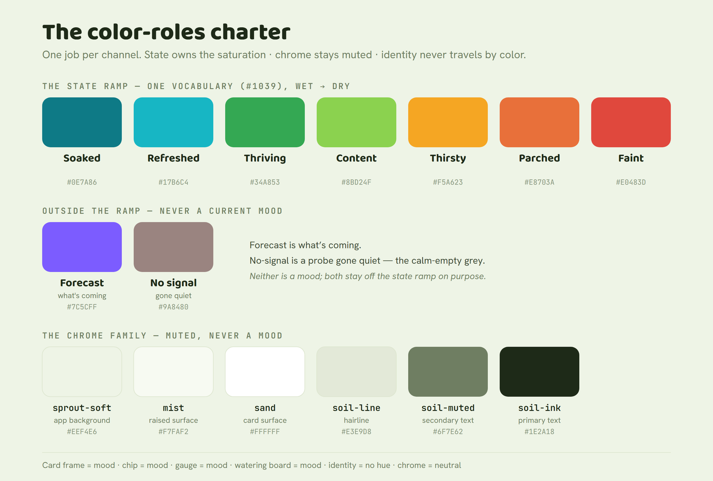

# The color-roles charter

> **Status:** the rescoped **#930** deliverable, ruled at the 2026-07-18 night-1 grill (Q2). **This charter
> — the rules — is V1.** The specific token *values* proposed inside these rules are **V2** (Design-QA
> proposes; iterations follow). Governs every surface that uses color. Builds on
> [ADR-0004](../../adr/0004-design-system.md) (tokens) and [ADR-0008](../../adr/0008-design-system-v3-personality-layer.md)
> (the band-derived mood layer); consumes values from [`sprout-tokens.css`](../tokens/sprout-tokens.css),
> never redefines them.

## Why this exists

Color was doing many jobs with no plan: per-plant identity colors that never changed with mood, a mood
system whose color never reached the card frame, a seven-band ladder with its own hues, a watering board that
was colors-on-colors, and history charts of indistinguishable same-hue lines. The fix isn't a nicer palette —
it's **one job per channel.** Color is a system with roles, and each role gets exactly one.

## The charter — one job per channel

### 1. State owns all the saturation

The plant's **current state — its mood — is the only thing allowed to be saturated.** A card's frame *is* its
mood; it is never a fixed identity color. Mood and band hues are **the state language**, and they read the
same on every surface that shows state (card frame, chip, gauge, band ladder). Saturation means "something is
happening here" — so only state gets to say it.

### 2. Chrome is a muted neutral family

Everything that isn't state — backgrounds, surfaces, borders, structural chrome — lives in a **muted neutral
family** grouped around **sprout-soft · mist · sand · soil**. (The group, not necessarily those exact four —
values are the V2 pass.) Chrome may **never** compete with state; if a neutral reads as a mood, it's wrong.

**Ruled out by name** (they sit too close to the shipped state hues and would blur the state channel):
leaf-deep, terracotta, shoot, sage, sun, sky, petal, honey, and blossom. The three directions offered in the
original #930 are rejected *as offered* — the muted-neutral family replaces them.

### 3. Identity never travels by color

A plant's identity is **never** carried by a hue. Color-as-identity doesn't scale — 24 plants are not 24
distinguishable colors (11 already blur on today's charts) — and it steals the saturation the state channel
needs. **Identity travels by the identity block:** name (or number-as-identity), a plant photo, the location
chip, and the pot descriptor.

**Identity may still carry muted colour — in a different register.** A plant photo has colour; so may a pot or
foliage. That doesn't break rule 1, because state and identity live in **two saturation registers**: state is
the *vivid* ramp; identity materials (pots, foliage) are *muted* naturals — terracotta, stone, ceramic,
sage-glaze, clay, charcoal — that can never be mistaken for a state hue. The guardrail: identity colour stays
**muted, capped in saturation, and confined to the identity thumbnail** — it never touches the frame, chip,
gauge, or any state surface. Differentiation *at a glance* comes from **form** — the photo, the plant
silhouette, the pot shape — not from hue.

### 4. The action flow this buys

> **State color finds the plant that needs you. The identity block tells you which physical plant it is.**

Color *finds*; identity *confirms*. That is the whole answer to "how do I know which of my plants to water" —
the saturated frame pulls your eye to the thirsty one, and the name/photo/location/pot on that card send you
to the right pot on the shelf.

### 5. State speaks one language

Mood hues (ADR-0008) and the seven band hues (ADR-0004) are **one state language — ruled, not proposed**
(#1039, 2026-07-18): one ramp of seven hues wearing seven words, the mood words as the band names. Wherever
state appears — frame, chip, gauge, ladder, chart ground — it's the same hue and the same word for the same
meaning. Diagnostics are not states: they live off-ladder, in the exceptions lane, in neutral.

## The state ramp — the one state language (proposed values · V2)

State is a single seven-step ramp, wet→dry. The mood colors (ADR-0008), the band ladder (ADR-0004), and the
status colors are **already the same hues** — this charter just declares them one ramp so nothing drifts.
Every surface that shows state reads from this ramp and nothing else.

| Step | The word | Hue | Token |
|---|---|---|---|
| 1 | Soaked | `#0E7A86` | `--band-saturated` |
| 2 | Refreshed | `#17B6C4` | `--band-wet` = `--st-watering` |
| 3 | Thriving | `#34A853` | `--band-moist` = `--leaf` |
| 4 | Content | `#8BD24F` | `--band-ideal` = `--sprout` |
| 5 | Thirsty | `#F5A623` | `--band-drying` = `--st-dry` |
| 6 | Parched | `#E8703A` | `--band-dry` = `--st-due` |
| 7 | Faint | `#E0483D` | `--band-parched` = `--st-fault` |

**One vocabulary (the #1039 ruling, 2026-07-18):** the seven mood words ARE the band names —
Soaked → Faint, wet → dry — on the dashboard, in this charter, and in the mark. The former parallel
band-word column (Saturated … Parched) is retired; the CSS token names stay as shipped (a token
rename is a contract change, not a vocabulary one). **The ramp is in-soil only** — every diagnostic
(air-dry / placement, physics, kinematics, comms) lives **off-ladder** in the exceptions lane and
wears the neutral treatment, never a ramp hue.

Two channels sit **outside** the state ramp on purpose, so they never read as a current mood:

- **Forecast / predicted** — `#7C5CFF` (`--st-predicted`): a distinct violet for *what's coming*, never a
  current state.
- **No signal / absence** — `#9A8480` (`--q-nosignal`): the calm-empty grey for a probe that isn't reporting.
  Absence gets its own quiet color; it is never a fault red.

## The chrome family — muted neutrals (proposed values · V2)

Chrome groups around **sprout-soft · mist · sand · soil** — muted, low-chroma, and never near the state ramp.
Proposed set (light shown; the soil/dark-mode set mirrors it), consumed from / folded into
[`sprout-tokens.css`](../tokens/sprout-tokens.css), never redefined:

| Name | Role | Light |
|---|---|---|
| sprout-soft | app background | `#EEF4E6` (`--bg`) |
| mist | raised surface | `#F7FAF2` (`--surface-2`) |
| sand | card / panel surface | `#FFFFFF` (`--surface`) |
| soil-line | hairline / border | `#E3E9D8` (`--border`) |
| soil-muted | secondary text | `#6F7E62` (`--muted`) |
| soil-ink | primary text | `#1E2A18` (`--ink`) |

They sit close to today's neutrals on purpose — the charter's job isn't to repaint chrome, it's to **name the
family and forbid saturation in it.** If a neutral ever reads as a mood, it is out.

## Per-component color map

The charter answers every component's color question the same way — *what channel is this?* — so nothing
invents its own scheme:

| Component | Color channel |
|---|---|
| **Card frame** | state ramp (the plant's current mood) |
| **Mood chip / band word** | state ramp |
| **Gauge / band ladder** | state ramp (the step, in context) |
| **Watering-status board** | state ramp only — no colors-on-colors; status *is* the state hue |
| **Forecast / next-need** | the violet forecast channel, distinct from state |
| **Empty / no-signal** | the calm-empty grey — absence, not a fault red |
| **Identity** (name/photo/location/pot) | **no hue** — chrome-neutral; identity never competes for saturation |
| **Chrome / structure** | the muted neutral family |
| **Multi-series charts** | series strokes = muted materials (identity); band-ground = state; focus = ink |

## Scope

**In this charter (V1):** the four color roles above (state · chrome · identity · charts), the muted-chrome
*family*, and the mood↔band consolidation *principle*.

**V2 (Design-QA proposes token values inside these rules):** the muted-neutral chrome values, the consolidated
state-hue set, and the swatch sheet — all consumed from / folded into `sprout-tokens.css`, never redefined.

**The chart-series pass (ruled forward, #930 2026-07-19):** a chart line is a plant's **identity**, so the
two-register principle settles multi-series charts too. Per-plant *state-hue* lines are **declared failed**
(four ramp hues rotated across twelve channels was the braided-lines bug); the ruled system:

- **Series strokes come from the muted materials register** (`--series-1..12` → `--mat-*`), never the state
  ramp — quiet, differentiated, legibility-first ordering.
- **The band-ground carries state**: horizontal band-tinted zones behind the lines; where a line sits *is*
  its state, read from the ground, not the stroke.
- **Focus-on-interaction**: selecting a plant (legend chip / hover) saturates that ONE series to
  `--series-focus` (ink) and drops the rest to `--series-faint` — one vivid line at a time, so the state
  channel stays uncontested.
- **Never a fleet-wide 0–100 raw normalization** behind a cross-plant chart (#1039 ruling 3); cross-board
  comparability rides the per-board-class anchor map, with a clearly-labeled envelope-position index where
  needed.

## References

- Ruling: [#930](https://github.com/OrangePeachPink/sprout/issues/930) (rescoped) · the #1039 night-1 grill
  (Q2, 2026-07-18) · the #875 Home-card contract (state frame + identity block).
- Foundations: [ADR-0004](../../adr/0004-design-system.md) · [ADR-0008](../../adr/0008-design-system-v3-personality-layer.md)
  · [`sprout-tokens.css`](../tokens/sprout-tokens.css) · the [design doctrine](design-doctrine.md).
